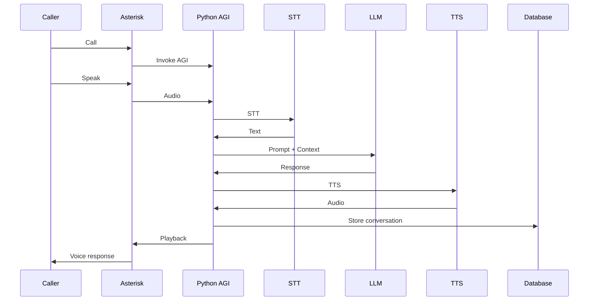

# asterisk_voip

🔁 Runtime Call Flow (Design View)
User Speaks
   ↓
Asterisk captures RTP audio
   ↓
Audio streamed via EAGI / ARI
   ↓
STT converts speech → text
   ↓
LLM generates response
   ↓
TTS converts text → audio
   ↓
Asterisk plays audio to user

----------------------------------------------------------------------------

Asterisk for Call → AGI Python Script → STT → LLM + Prompt → TTS → Store Call & Conversation in DB → User Listens to Voice

----------------------------------------------------------------------------

## System Architecture

